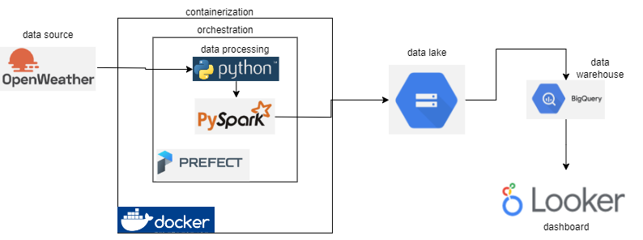

#### Weather Data Pipeline
This is a PySpark-based data pipeline that fetches weather data for a few cities, performs some basic processing and transformation on the data, and then writes the processed data to a Google Cloud Storage bucket and a BigQuery table.The data is then viewed in a looker dashboard 

##### link to looker dashboard
[weather_data_chart](https://lookerstudio.google.com/s/viy26u7mGdw)

##### pipeline


##### Requirements
To run this application, you will need:
- Python 3.x
-  Docker
- Google Cloud Platform account with appropriate credentials for accessing GCS and BigQuery
- prefect
- looker studio

##### Setup
Clone the repository and navigate to the project directory.
Install the dependencies using pip by running the following command: pip install -r requirements.txt.

##### Configuration
Create a new Google Cloud Storage bucket to store the output data.
Create a new BigQuery dataset and table to store the output data.
Update the bucket_name and table_name variables in the write_weather_data_to_gcs and write_weather_data_to_bigquery tasks, respectively, with the appropriate names of the bucket and table you created.
##### Running the Pipeline
To run the pipeline, follow these steps:
Open a terminal window and navigate to the project directory.
Build the Docker image using the following command: docker build -t weather-data-pipeline .
Run the Docker container using the following command: docker run ```--rm -it -v $(pwd):/app -e GOOGLE_APPLICATION_CREDENTIALS=/app/your-credentials.json weather-data-pipeline```
Note: Replace your-credentials.json with the name of your Google Cloud Platform service account key file.
The pipeline will run and the output data will be written to the Google Cloud Storage bucket and BigQuery table you specified in the configuration step.
##### Troubleshooting

If you encounter any issues while running the pipeline, please check the following:

Ensure that the Google Cloud Platform credentials you specified are valid and have the appropriate permissions to access GCS and BigQuery.
Ensure that the bucket and table names you specified in the configuration step are correct.
Check the logs for any error messages that might indicate the cause of the issue.
